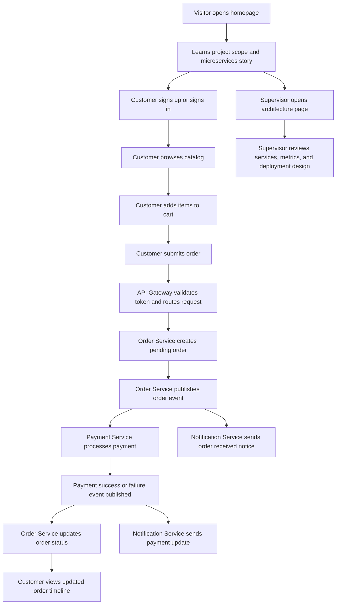

## 1. Product Overview
The product is a research-driven, cloud-based Retail Order Management System that demonstrates how a monolithic commerce workflow can be reimagined as a scalable microservices platform. It serves two audiences at once: users who need a functional ordering experience, and academic reviewers who need to clearly see the system scope, architecture, and implementation quality from the homepage onward.

- Main purpose: demonstrate identity, catalog, order, payment, and notification workflows inside a microservices architecture with a highly explanatory and visually compelling interface.
- Problem solved: bridges the gap between theoretical microservices research and a practical, implementation-ready final year project.
- Target users: project supervisors, examiners, students, researchers, and demo customers testing the platform.
- Product value: combines a production-style fullstack experience with an academic showcase that explains architecture, scalability, observability, and deployment decisions in a way that is easy to understand.

## 2. Core Features

### 2.1 User Roles
| Role | Registration Method | Core Permissions |
|------|---------------------|------------------|
| Visitor | No registration | View homepage, architecture story, team section, and public catalog overview |
| Customer | Email and password | Browse catalog, add items to cart, place orders, track order status |
| Demo Admin | Seeded credentials | Manage products, view system metrics, inspect event flow and demo data |

### 2.2 Feature Module
1. **Homepage**: immersive hero, research summary, scope explanation, animated architecture preview, tech stack highlights, observability showcase, supervisor and student researcher profiles.
2. **Authentication page**: sign up, sign in, protected session handling, role-aware navigation.
3. **Catalog page**: product listing, filtering, search, stock status, product detail drawer or detail page.
4. **Cart and checkout page**: cart review, pricing summary, mock payment submission, order creation flow.
5. **Orders dashboard**: order history, order status timeline, payment result, notification history.
6. **Architecture and monitoring page**: service map, request flow, event bus visualization, logs, metrics, trace-inspired timeline, deployment overview.
7. **Admin operations page**: create and update products, inspect order queue states, demo service health, seed reset actions.

### 2.3 Page Details
| Page Name | Module Name | Feature description |
|-----------|-------------|---------------------|
| Homepage | Hero section | Cinematic intro with animated gradients, service cards, clear project statement, and direct explanation of the project scope before any deeper navigation |
| Homepage | Research overview | Converts the paper into digestible sections: problem, objectives, architecture decisions, and expected outcomes |
| Homepage | Architecture highlight | Animated visual showing API gateway, five services, message broker, observability, and cloud deployment layers |
| Homepage | Team spotlight | Display supervisor details and student researchers with image areas, names, and matric numbers in a premium academic showcase layout |
| Homepage | Proof of value | Sections for scalability, fault isolation, independent deployment, service discovery, and observability benefits |
| Authentication | Sign in and sign up | JWT-based login and registration flow for demo customers and admin access |
| Catalog | Product grid | Searchable and filterable catalog with inventory status, category filters, and polished card interactions |
| Catalog | Product detail | Price, description, stock state, service-backed availability checks, add-to-cart actions |
| Checkout | Cart summary | Quantity edits, totals, selected items, delivery summary, and simulated payment confirmation |
| Checkout | Payment flow | Submits order, triggers async payment workflow, and immediately returns a pending order state |
| Orders dashboard | Status timeline | Tracks order progression from pending to confirmed or failed using service events |
| Orders dashboard | Notification log | Shows generated customer notifications for order and payment outcomes |
| Architecture page | Request flow explorer | Step-by-step UI for gateway validation, catalog lookup, order write, event publish, payment processing, and notification dispatch |
| Architecture page | Monitoring panel | Demo metrics, health checks, trace-like request history, and service availability indicators |
| Admin operations | Product management | CRUD operations for products and stock levels |
| Admin operations | Service health | Display health endpoints, seeded traffic insights, and environment readiness |

## 3. Core Process
Visitors land on the homepage and immediately understand the academic objective, business case, service boundaries, and the team behind the project. A customer can then register, browse the catalog, add items to cart, submit an order, and watch the system process payment and notifications through an event-driven flow. Admin users can manage products and inspect service health, while supervisors and examiners can review the architecture and observability story from dedicated explanatory views.

## 4. User Interface Design
### 4.1 Design Style
- Primary palette: deep graphite, midnight navy, and cloud blue with vivid amber and emerald accents for system states
- Secondary palette: warm ivory surfaces for readable content blocks and muted steel tones for technical sections
- Button style: rounded-rectangle buttons with subtle elevation, luminous edge highlights, and motion-led hover states
- Typography: a distinctive display serif for high-impact headings paired with a refined, highly readable sans-serif for body text
- Layout style: desktop-first editorial storytelling on the homepage, layered dashboard panels for application views, large section transitions, and intentional asymmetry
- Icon style: modern line icons with selective 3D-glass accents for service badges and status chips
- Motion style: staggered entrances, parallax scroll reveals, micro-interactions on cards, animated service topology lines, and flowing background atmospherics

### 4.2 Page Design Overview
| Page Name | Module Name | UI Elements |
|-----------|-------------|-------------|
| Homepage | Hero section | Bold headline, animated architecture backdrop, project badge, CTA buttons, layered metric cards |
| Homepage | Research overview | Editorial content blocks, highlighted quotations, animated dividers, chapter-based summary cards |
| Homepage | Team spotlight | Framed profile cards with image area, names, roles, and matric numbers presented in an academic showcase |
| Homepage | Scope explainer | Horizontal story rail for objectives, tools, deployment strategy, and observability pillars |
| Authentication | Form panel | Focused card layout, validation feedback, role entry points, secure visual language |
| Catalog | Product listing | Dense but elegant grid, search bar, category chips, stock indicators, hover motion |
| Checkout | Order summary | Structured pricing panel, trust indicators, processing state animations |
| Orders dashboard | Timeline and tables | Mixed data cards, badges, progress rails, and service-event breadcrumbs |
| Architecture page | Service map | Animated node graph, trace panel, event stream cards, deployment layers |
| Admin operations | Control workspace | Tables, drawers, status monitors, quick actions, and audit-friendly summaries |

### 4.3 Responsiveness
The product follows a desktop-first design to match final year project presentation and supervision workflows, then adapts to tablets and mobile screens with stacked panels, simplified motion density, collapsible technical diagrams, and touch-friendly controls.

### 4.4 3D Scene Guidance
- Environment and mood: futuristic cloud control room with calm depth, subtle haze, and premium academic polish
- Lighting: low-key background lighting with brighter edge illumination on service nodes and interactive cards
- Camera motion: slow drift and scroll-linked perspective shifts on the homepage hero only
- Composition: central service constellation supported by offset content panels and floating telemetry surfaces
- Interactions and animations: line pulses between services, event particles, and metric card reveals tied to scroll progression
- Post-processing: soft bloom on accents, restrained blur layers, and noise texture for depth
- Asset and performance guidance: use lightweight CSS and canvas-driven effects where possible; keep hero motion performant and degrade cleanly on low-power devices
