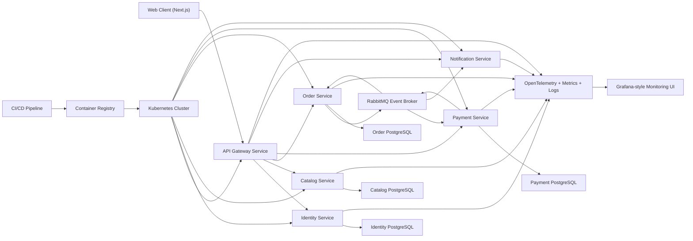
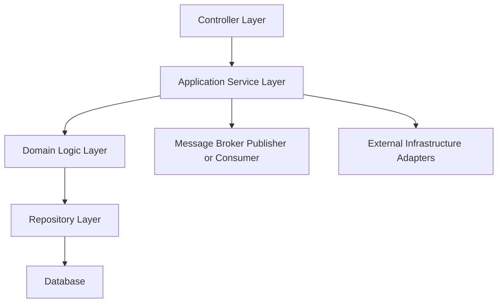
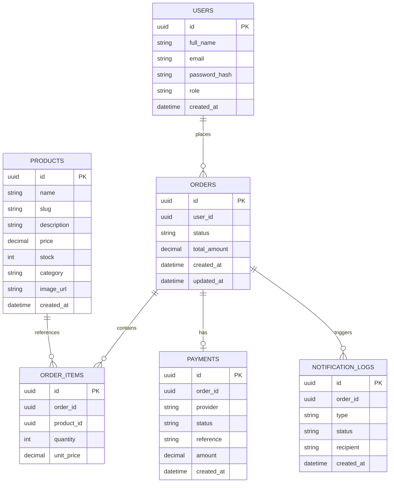

## 1. Architecture Design


## 2. Technology Description
- Monorepo and package management: `pnpm` workspaces with Turborepo for independent app and service orchestration
- Frontend: Next.js 15 + React 19 + TypeScript + Tailwind CSS + Framer Motion
- Design system: custom component system inspired by high-quality product design and Material motion principles, without generic template aesthetics
- Backend services: NestJS for API Gateway, Identity Service, Catalog Service, Order Service, Payment Service, and Notification Service
- Databases: PostgreSQL per core service (`identity`, `catalog`, `orders`, `payments`)
- Cache and rate limiting: Redis for gateway throttling and short-lived session or response caching
- Messaging: RabbitMQ for `OrderPlaced`, `PaymentSucceeded`, and `PaymentFailed` events
- Authentication: JWT access tokens with refresh token support
- Observability: OpenTelemetry instrumentation, structured logs, Prometheus-compatible metrics, and Grafana dashboards
- Local development: Docker Compose
- Cloud and orchestration target: Kubernetes with Ingress, ConfigMaps, Secrets, Deployments, Services, and Horizontal Pod Autoscaler
- Testing: Playwright for frontend flows, Jest for unit and integration tests, Supertest for service API verification

## 3. Route Definitions
| Route | Purpose |
|-------|---------|
| / | High-impact homepage explaining the project scope, architecture, value, supervisor, and student researchers |
| /auth/sign-in | Customer and demo admin authentication |
| /auth/sign-up | Customer registration |
| /catalog | Browse, search, and filter products |
| /catalog/[productId] | View product detail and availability |
| /checkout | Review cart and submit order |
| /orders | View customer order history |
| /orders/[orderId] | View order detail, timeline, and payment/notification progress |
| /architecture | Explore service topology, request flow, observability, and deployment model |
| /admin | Manage products and inspect service health as demo admin |

## 4. API Definitions

### 4.1 Shared Types
```ts
type ApiResponse<T> = {
  success: boolean;
  message: string;
  data?: T;
};

type AuthTokens = {
  accessToken: string;
  refreshToken: string;
  expiresIn: number;
};

type UserRole = "customer" | "admin";

type OrderStatus =
  | "pending"
  | "payment_processing"
  | "confirmed"
  | "failed"
  | "cancelled";
```

### 4.2 Gateway and Identity APIs
| Method | Endpoint | Purpose |
|--------|----------|---------|
| POST | /api/auth/register | Create customer account |
| POST | /api/auth/login | Authenticate user and issue tokens |
| POST | /api/auth/refresh | Refresh access token |
| GET | /api/auth/me | Return authenticated profile |

### 4.3 Catalog APIs
| Method | Endpoint | Purpose |
|--------|----------|---------|
| GET | /api/catalog/products | List products with search, category, and stock filters |
| GET | /api/catalog/products/:id | Return a single product |
| POST | /api/catalog/products | Create product as admin |
| PATCH | /api/catalog/products/:id | Update product and stock as admin |

### 4.4 Order APIs
| Method | Endpoint | Purpose |
|--------|----------|---------|
| POST | /api/orders | Create order and publish `OrderPlaced` event |
| GET | /api/orders | Return current user's orders |
| GET | /api/orders/:id | Return order detail and status timeline |
| PATCH | /api/orders/:id/status | Internal endpoint for event-driven status updates |

### 4.5 Payment APIs
| Method | Endpoint | Purpose |
|--------|----------|---------|
| POST | /api/payments/process | Internal or admin-triggered payment simulation |
| GET | /api/payments/:orderId | Return payment record for an order |

### 4.6 Notification APIs
| Method | Endpoint | Purpose |
|--------|----------|---------|
| GET | /api/notifications/:orderId | Return notification history for an order |
| POST | /api/notifications/test | Demo endpoint for notification testing |

### 4.7 Example Request and Response
```ts
type CreateOrderRequest = {
  items: Array<{
    productId: string;
    quantity: number;
  }>;
};

type CreateOrderResponse = ApiResponse<{
  orderId: string;
  status: "pending";
  totalAmount: number;
}>;
```

## 5. Server Architecture Diagram


## 6. Data Model
### 6.1 Data Model Definition


### 6.2 Data Definition Language
```sql
CREATE TABLE users (
  id UUID PRIMARY KEY,
  full_name VARCHAR(150) NOT NULL,
  email VARCHAR(150) UNIQUE NOT NULL,
  password_hash TEXT NOT NULL,
  role VARCHAR(20) NOT NULL DEFAULT 'customer',
  created_at TIMESTAMP NOT NULL DEFAULT CURRENT_TIMESTAMP
);

CREATE TABLE products (
  id UUID PRIMARY KEY,
  name VARCHAR(160) NOT NULL,
  slug VARCHAR(180) UNIQUE NOT NULL,
  description TEXT NOT NULL,
  price NUMERIC(12,2) NOT NULL,
  stock INTEGER NOT NULL DEFAULT 0,
  category VARCHAR(80) NOT NULL,
  image_url TEXT NOT NULL,
  created_at TIMESTAMP NOT NULL DEFAULT CURRENT_TIMESTAMP
);

CREATE TABLE orders (
  id UUID PRIMARY KEY,
  user_id UUID NOT NULL,
  status VARCHAR(40) NOT NULL,
  total_amount NUMERIC(12,2) NOT NULL,
  created_at TIMESTAMP NOT NULL DEFAULT CURRENT_TIMESTAMP,
  updated_at TIMESTAMP NOT NULL DEFAULT CURRENT_TIMESTAMP
);

CREATE TABLE order_items (
  id UUID PRIMARY KEY,
  order_id UUID NOT NULL,
  product_id UUID NOT NULL,
  quantity INTEGER NOT NULL,
  unit_price NUMERIC(12,2) NOT NULL
);

CREATE TABLE payments (
  id UUID PRIMARY KEY,
  order_id UUID UNIQUE NOT NULL,
  provider VARCHAR(80) NOT NULL DEFAULT 'demo-pay',
  status VARCHAR(40) NOT NULL,
  reference VARCHAR(120) NOT NULL,
  amount NUMERIC(12,2) NOT NULL,
  created_at TIMESTAMP NOT NULL DEFAULT CURRENT_TIMESTAMP
);

CREATE TABLE notification_logs (
  id UUID PRIMARY KEY,
  order_id UUID NOT NULL,
  type VARCHAR(80) NOT NULL,
  status VARCHAR(40) NOT NULL,
  recipient VARCHAR(150) NOT NULL,
  created_at TIMESTAMP NOT NULL DEFAULT CURRENT_TIMESTAMP
);

CREATE INDEX idx_products_category ON products(category);
CREATE INDEX idx_orders_user_id ON orders(user_id);
CREATE INDEX idx_orders_status ON orders(status);
CREATE INDEX idx_order_items_order_id ON order_items(order_id);
CREATE INDEX idx_payments_order_id ON payments(order_id);
CREATE INDEX idx_notification_logs_order_id ON notification_logs(order_id);
```

## 7. Implementation Notes
- The frontend will act as the presentation layer only; all business workflows will pass through the API Gateway so the architecture remains faithful to the research paper.
- The homepage will be treated as both a product landing page and an academic explainer, with sections that make the project scope understandable before the user explores the app.
- The team section will include supervisor and student researcher cards with image support, names, and matric numbers. Until real photos are provided, the UI will support either generated portraits or branded profile art without breaking layout quality.
- Service discovery in local development can be handled by Docker Compose networking, while Kubernetes Services provide discovery in the deployment model.
- Payment will be implemented as a secure mock processor for the project demo so the system proves the event-driven workflow without storing raw card data.
